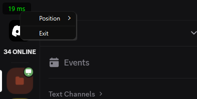

# Ping Overlay

A lightweight, always-on-top ping monitor for Windows that shows your network latency in real-time. Perfect for gamers, streamers, or anyone who needs to monitor their network connection without opening a command prompt.



## Features

- 🖥️ **Always on Top**: Stays visible above other windows
- 🎯 **Customizable Position**: Drag anywhere or use preset positions
- 🎨 **Customizable Color Thresholds**: Set your own ping ranges for green/yellow/red
- 🌐 **Custom Host**: Ping any server (Google, game servers, etc.)
- 🖱️ **Draggable**: Click and drag to position anywhere
- 🎮 **Gaming-Friendly**: Click-through mode prevents interference with games
- ⚡ **Real-time Updates**: Updates every second
- 🎯 **Corner Snapping**: Easily position in any corner
- 🖼️ **Semi-transparent**: See through to content below
- 🔧 **System Tray Integration**: Control everything from the system tray
- ⚙️ **Persistent Settings**: Your preferences are saved and remembered

## Quick Start

### Option 1: Download the Executable

1. Go to the [Releases](https://github.com/rainerat/PingOverlay/releases) page
2. Download `ping_overlay.exe`
3. Run it!

### Option 2: Build from Source

1. Clone the repository:
   ```bash
   git clone https://github.com/rainerat/PingOverlay.git
   cd PingOverlay
   ```
2. Install dependencies:
   ```bash
   pip install -r requirements.txt
   ```
3. Run the application:
   ```bash
   python ping_overlay.py
   ```

## Usage

### Basic Controls

- **Move**: Click and drag the overlay (when not in click-through mode)
- **Position Presets**: Right-click overlay → Position → Choose corner
- **Hide Overlay**: Right-click overlay → Hide Overlay

### System Tray Controls

- **Show/Hide Overlay**: Toggle the "Show Overlay" checkbox
- **Toggle Click-Through**: Enable/disable mouse click transparency
- **Open Settings**: Configure host, color thresholds, and preferences
- **Exit**: Close the application completely

### Settings Dialog

- **Custom Host**: Enter any server address (e.g., `google.com`, `8.8.8.8`, game servers)
- **Color Thresholds**: Set your own ping ranges for green/yellow/red colors
- **Click-Through Mode**: Enable transparent mouse clicks for gaming
- **Startup Options**: Choose whether to show settings on startup

## Gaming Features

### Click-Through Mode

- **Perfect for Gaming**: Enable click-through mode to prevent the overlay from interfering with your games
- **No Accidental Clicks**: Mouse clicks pass through the overlay to the game underneath
- **Easy Toggle**: Use the system tray menu to quickly enable/disable click-through
- **Visual Feedback**: Overlay remains visible but becomes completely transparent to mouse input

### Custom Hosts for Gaming

- **Game Servers**: Ping your favorite game servers directly
- **Regional Servers**: Test latency to different server regions
- **Custom IPs**: Use any IP address or domain name

## Customization

### Settings Dialog

- **Host**: Set any server to ping
- **Color Thresholds**: Customize when ping shows green/yellow/red
- **Click-Through**: Toggle mouse transparency
- **Startup Behavior**: Control whether settings appear on startup

### Advanced Customization

You can modify these variables in `ping_overlay.py`:

- `CORNER_MARGIN`: Distance from screen edges (default: 5 pixels)
- Font size and colors in the `setStyleSheet` section

## Building from Source

To create your own executable:

```bash
pip install pyinstaller
pyinstaller --noconfirm --onefile --windowed --icon=icon.ico ping_overlay.py
```

The executable will be in the `dist` folder.

## Running on Startup

### Method 1: Startup Folder

1. Press `Win + R`
2. Type `shell:startup`
3. Copy `ping_overlay.exe` to this folder

### Method 2: Task Scheduler

1. Open Task Scheduler
2. Create Basic Task
3. Set trigger to "At log on"
4. Action: Start a program
5. Browse to `ping_overlay.exe`

## Contributing

Contributions are welcome! Feel free to:

- Report bugs
- Suggest features
- Submit pull requests

## License

This project is licensed under the [MIT License](LICENSE).

## Acknowledgments

- Built with [PyQt6](https://www.riverbankcomputing.com/software/pyqt/)
- Ping functionality using [ping3](https://github.com/kyan001/ping3)
